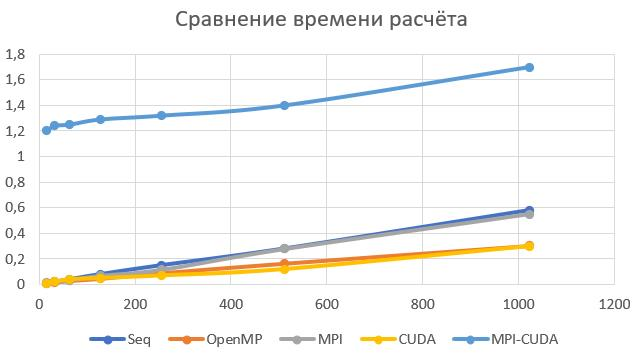

## Бизнес-логика
Агрегация вектора из N элементов в вектор размером N/M, где для каждой группы из M-элементов вычисляется агрегирующая функция AVG.

## Описание алгоритма выполнения бизнес-логики
В качестве типа данных используется double. Размер вектора N поддерживается гарантированно до 2^27 элементов, возможно, больше.

В последовательной версии происходит итерация по оригинальному вектору. Для каждой группы из M элементов последовательно считается сумма, после чего `AVG=sum/M` записывается в новый вектор результатов.

Для передачи данных используется протокол TCP (Unix). При обнаружении подключения генератор отправляет нужное количество данных, разбивая их на фрагменты по 1 КБ. После получения всех данных клиент обрабатывает их и отсылает результат обратно вместе с временем выполнения расчётов.

## Описание логики распараллеливания

### OpenMP
Вычисления разделяются по группам из М-элементов. Для каждой группы среднее вычисляется отдельно при помощи директивы `#pragma omp for`. Распределение групп по потокам не контролируется, оставляется на управление OpenMP.

### MPI
Процесс-хост управляет получением данных, остальные ожидают. После того, как хост получил весь объём данных, через `MPI_Bcast` всем процессам рассылается общий размер данных. Далее каждый процесс исходя из своего номера вычисляет количество "блоков" по M элементов для собственной обработки (включая первый процесс). После обработки вектора результатов высылаются на хост, и он отправляет ответ на сервер.

### CUDA
После получения данных запускается ядро CUDA, состоящее из `N/M/1024` блоков по 1024 потоков каждый. Каждый поток обрабатывает свою группу из M элементов. При недостатке потоков один поток может вычислять несколько групп.

### MPI+CUDA
В отличие от варианта с MPI, каждый процесс вместо самостоятельного вычисления результата запускает ядро CUDA, в котором уже каждая группа обрабатывается (по возможности) отдельным потоком.


## Установка
```sh
sudo apt-get install libomp-dev
sudo apt-get install mpich
#magicallly install cuda somehow
```

## Запуск
Запуск производится из любой требуемой подпапки.
```sh
make
make host
# separate window
make cli
```

## Зависимость времени выполнения (с) от размера данных (МБ)


