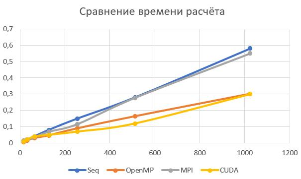

## Бизнес-логика
Агрегация вектора из N элементов в вектор размером N/M, где для каждой группы из M-элементов вычисляется агрегирующая функция AVG.

## Описание алгоритма выполнения бизнес-логики
В качестве типа данных используется double. Размер вектора N поддерживается гарантированно до 2^27 элементов, возможно, больше.

В последовательной версии происходит итерация по оригинальному вектору. Для каждой группы из M элементов последовательно считается сумма, после чего `AVG=sum/M` записывается в новый вектор результатов.

Для передачи данных используется протокол TCP (Unix). При обнаружении подключения генератор отправляет нужное количество данных, разбивая их на фрагменты по 1 КБ. После получения всех данных клиент обрабатывает их и отсылает результат обратно вместе с временем выполнения расчётов.

## Установка
```sh
sudo apt-get install libomp-dev
sudo apt-get install mpich
```

## Запуск (в любой подпапке)
```sh
make
make host &
make cli
```

## Зависимость времени выполнения (с) от размера данных (МБ)


При последовательной реализации зависимость линейная.